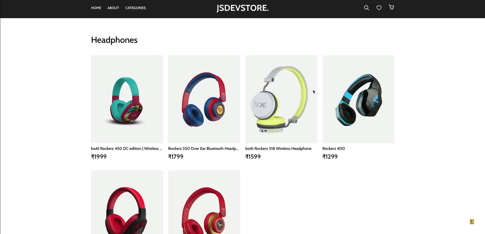
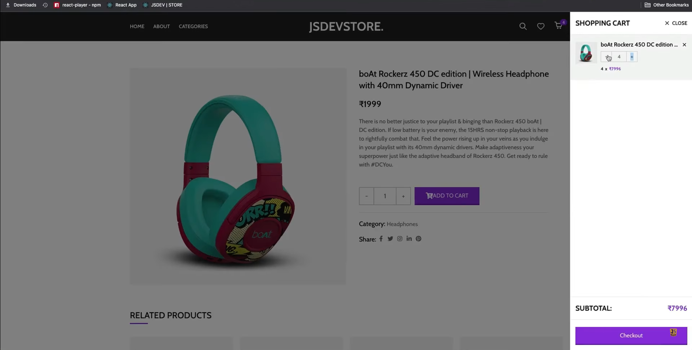
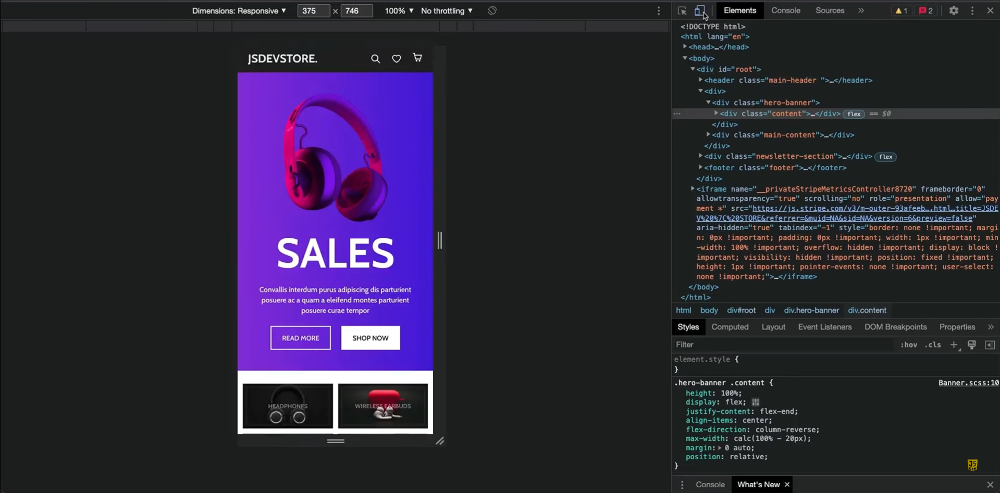
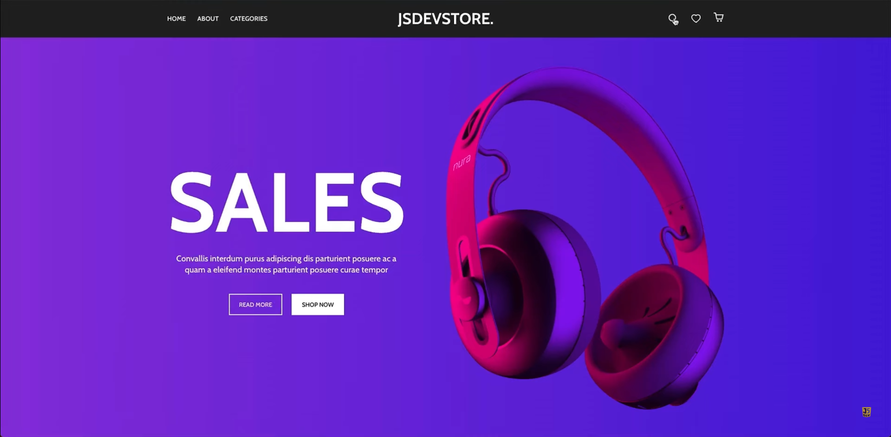
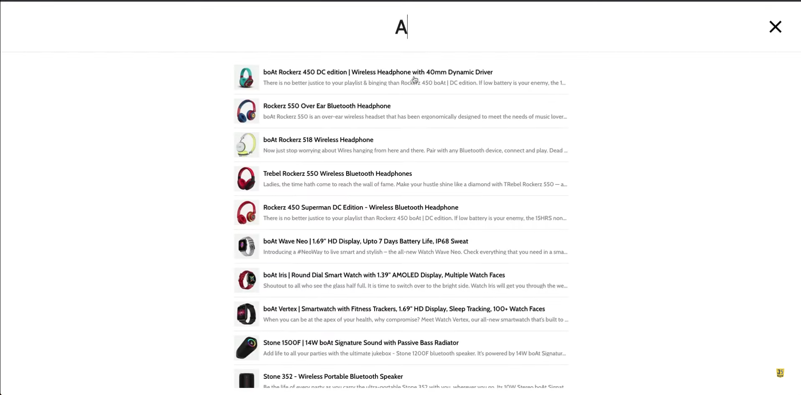
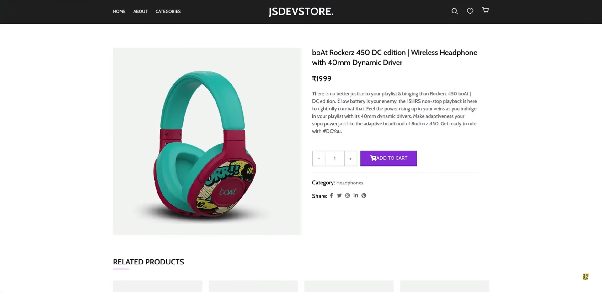
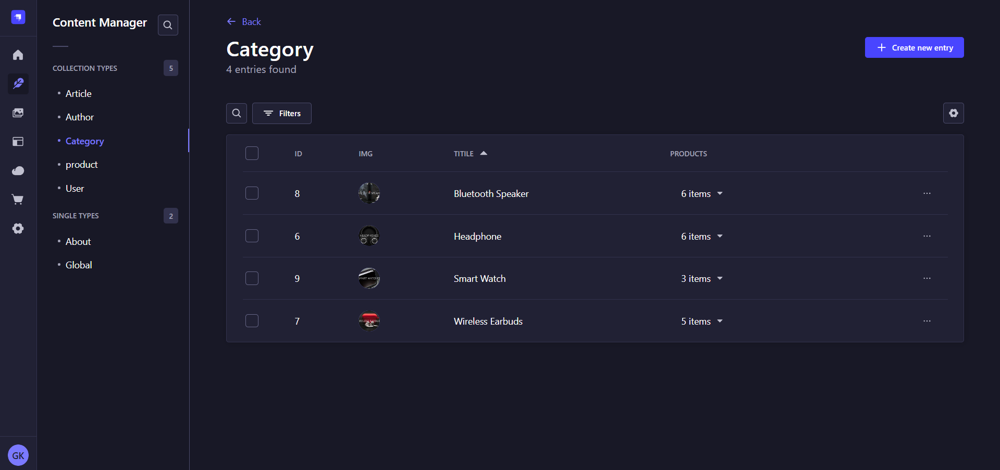
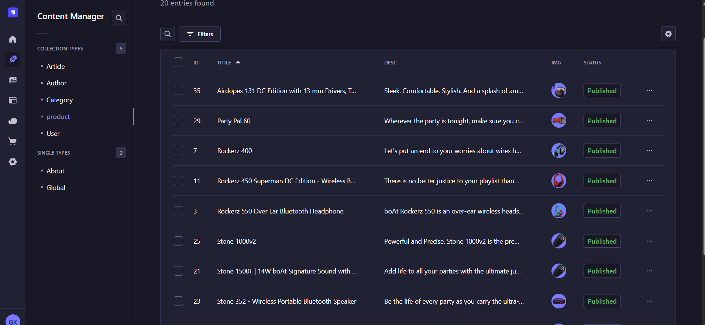

# 🛒 E-Commerce Product Page

A fully responsive e-commerce product page built using **React** for the frontend and **Strapi** for the backend. This project fulfills all the core requirements outlined in the "Web Developer Task" assignment PDF, showcasing frontend and backend integration, dynamic UI/UX, and a functional shopping cart system.

---
## 📸 Screenshots

<h3>Product Listing Page</h3>
  

<h3>Cart Page</h3>
  

<h3>Mobile Responsive View</h3>


<h3>NavBar & Banner</h3>


<h3>Search Page</h3>


<h3>Single Product Page</h3>


<h3>Starpi for Category</h3>


<h3>Starpi for Product</h3>


---

## 📌 Features

### ✅ Core Features
- 🖼️ View a list of products with image, title, description, and price
- 🔍 Search and filter products by name or category
- 🛒 Add products to a cart
- 📦 View items in the cart along with the total price
- ❌ Remove items from the cart
- 📱 Fully responsive layout for mobile, tablet, and desktop devices

### 🌟 Bonus Features
- 💾 Product and cart data stored using **Strapi** and/or **localStorage**
- 📋 Order summary / confirmation screen after cart checkout
- 🔐 Dummy login/register system *(optional enhancement)*
- 🔗 API integration for fetching product data from backend
- ⚛️ Built using modern frameworks (React for frontend, Strapi for backend)

---

## 🛠️ Tech Stack

| Category       | Technology                       |
|----------------|----------------------------------|
| Frontend       | React, HTML, CSS, JavaScript     |
| Backend        | Strapi (Node.js Headless CMS)    |
| Styling        | SCSS3                            |
| State Handling | React Hooks (useState, useEffect)|
| Data Storage   | Strapi API                       |
| Deployment     | GitHub Pages / Netlify / Vercel  |

---

---

## 🧪 How to Run Locally

### 🔧 Prerequisites
- Node.js (v14+)
- npm or yarn
- Strapi CLI: `npm install strapi@latest -g`

### 📦 Frontend Setup &⚙️ Backend Setup (Strapi)

```bash
#frontend

# Clone the repository
git clone https://github.com/your-username/your-repo-name.git
cd your-repo-name

# Install dependencies
npm install

# Start the React app
npm start

-----------------------------------------
#backend

# Navigate to backend directory
cd strapi-backend

# Install Strapi dependencies
npm install

# Run the Strapi CMS server
npm run develop
